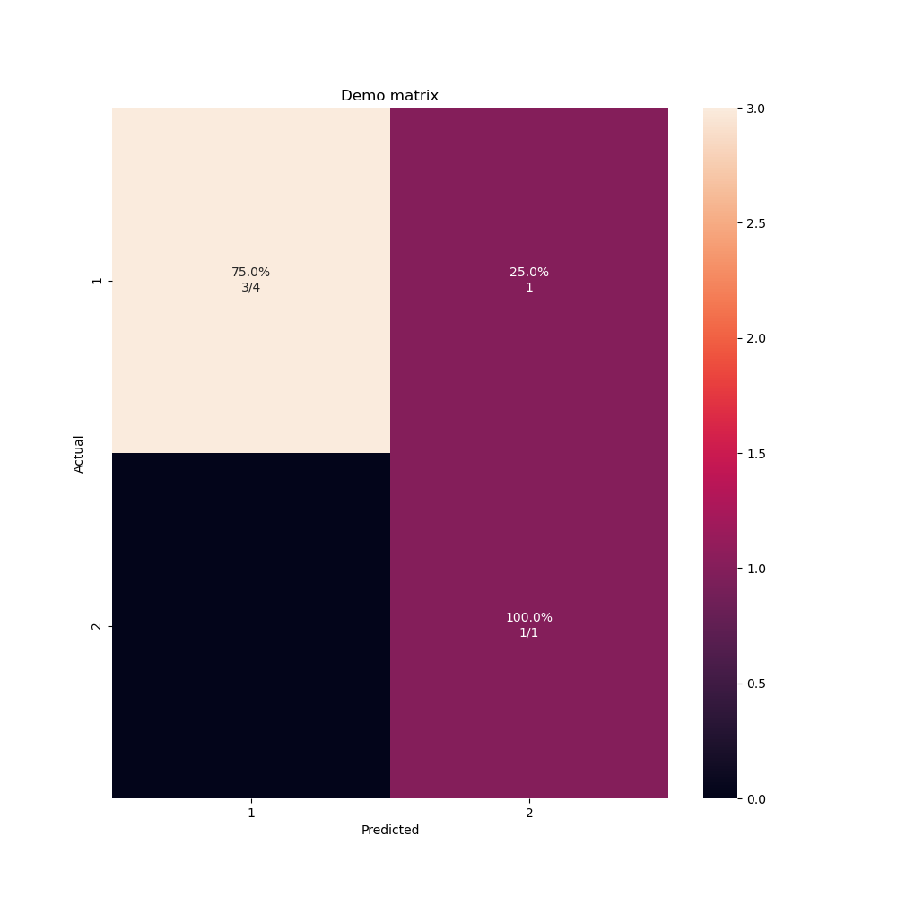

# sweet-confusion-matrix
Confusion Matrix in Python using Matplotlib

```
pip install sweetconfusionmatrix
```

## Demo

```python
import sweetconfusionmatrix
sweetconfusionmatrix.cm([1, 1, 1, 2, 1],[1, 1, 1, 2, 2], [1,2], title="Demo matrix", filename="demo.png")
```




## Build

```
python3 setup.py bdist_wheel
python3 -m pip install dist/sweetconfusionmatrix-0.1-py3-none-any.whl
twine upload --verbose dist/*
```